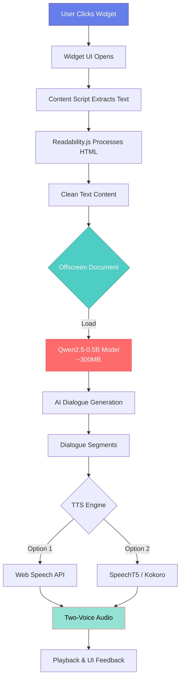
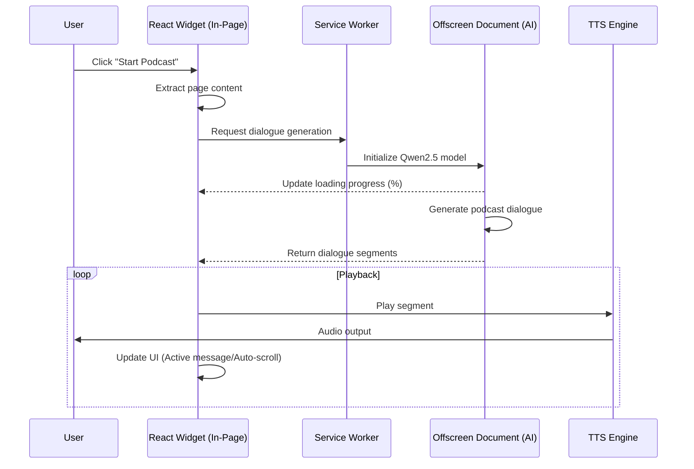

# 🎙️ WebPodify - Chrome Extension

<div align="center">

**Convert any webpage into a 2-person podcast-style conversation using AI**

*100% Client-Side • Free • No Server Required • Privacy Focused*

[](https://chrome.google.com/webstore)
[](LICENSE)
[](https://reactjs.org/)
[](https://huggingface.co/Xenova/Qwen2.5-0.5B-Instruct)

</div>

---

## ✨ Features

- 🤖 **Advanced AI Dialogue**: Uses **Qwen2.5-0.5B-Instruct** for natural, engaging, and context-aware conversations.
- 💬 **In-Page Chat Widget**: Interactive overlay widget with real-time progress and a modern chat-like interface.
- 🎙️ **Two-Voice Narration**: Seamless switching between two distinct voices for a true podcast experience.
- ⚡ **Manifest V3 & Offscreen API**: Rock-solid stability using Chrome's Offscreen API for heavy AI processing and background audio.
- 🛡️ **100% Privacy**: All processing (AI generation & TTS) happens locally in your browser. No data ever leaves your machine.
- 🌙 **Night Mode**: Beautiful dark and light themes that match your preference.
- 📥 **Script Export**: Download the generated podcast script for later reading.
- 🎚️ **Playback Control**: Real-time speed adjustment (0.5x - 2.0x) and pause/resume functionality.

---

## 🏗️ Architecture & Data Flow



---

## 🔄 Detailed Data Flow



---

## 🛠️ Tech Stack

### AI & Machine Learning
- **Transformers.js**: High-performance ML runtime for the browser.
- **Qwen2.5-0.5B-Instruct**: Latest generation small language model for high-quality dialogue.
- **SpeechT5**: Neural text-to-speech for natural-sounding voices.

### Frontend
- **React 18**: Powering the modern, responsive in-page widget.
- **Shadow DOM**: Ensures widget styles don't conflict with the website you're visiting.
- **Vite**: Ultra-fast build tool and development server.

### Browser Integration
- **Manifest V3**: Using the latest extension standards.
- **Offscreen API**: Handles memory-intensive AI tasks and persistent audio playback.
- **Chrome Storage**: Persists user settings and preferences.

---

## 🤖 AI Tools & Models

| Tool | Purpose | Size (Quantized) | Type |
|------|---------|------|------|
| **Qwen2.5-0.5B** | High-quality dialogue generation | ~300MB | LLM (Instruct) |
| **SpeechT5** | Neural TTS generation | ~100MB | Encoder-Decoder |
| **Transformers.js** | Client-side ML runtime | ~2MB | JS Library |
| **Readability.js** | Content extraction | ~50KB | DOM Parser |

---

## 📦 Project Structure

```
webpodcast/
├── 📁 src/
│   ├── 📁 ai/                 # AI model management & dialogue logic
│   ├── 📁 background/         # Service Worker & Offscreen documents
│   ├── 📁 content/             # In-page Widget & Content scripts
│   ├── 📁 popup/              # Chrome extension popup (Entry point)
│   ├── 📁 tts/                # Text-to-Speech engines
│   ├── 📁 utils/              # Storage & helper utilities
│   └── 📁 options/             # Settings & Configuration page
├── 📁 public/                 # Static assets (icons, etc.)
├── 📁 website/                # Vercel-deployed landing page
├── manifest.json              # Extension manifest (MV3)
├── vite.config.js             # Main Vite configuration
└── vite.content.config.js      # Content script specific build config
```

---

## 🚀 Installation

### Prerequisites
- Node.js 18+ 
- npm or yarn
- Google Chrome browser

### Steps

1. **Clone and Install**
   ```bash
   git clone https://github.com/swati2904/webpodcast.git
   cd webpodcast
   npm install
   ```

2. **Build the Project**
   ```bash
   npm run build
   ```

3. **Load in Chrome**
   - Navigate to `chrome://extensions/`
   - Enable **Developer mode**
   - Click **Load unpacked** and select the `dist` folder.

4. **Start Listening**
   - Visit any article or webpage.
   - Click the 🎙️ floating widget button.
   - Click **Start Podcast** (First run will download models ~300MB).

---

## 🔧 Configuration

Access the **Settings** via the gear icon ⚙️ in the widget or the extension options:
- **Speaker Personalities**: Choose different accents for the Host and Guest.
- **Theme**: Toggle between Night (Dark) and Day (Light) modes.
- **Playback Speed**: Adjust from 0.5x to 2.0x.
- **TTS Engine**: Switch between Web Speech API and Neural TTS (experimental).

---

## 📈 Future Enhancements

- [ ] **Multi-Language Support**: Support for Spanish, French, German, etc.
- [ ] **Speaker Customization**: Custom names and traits for AI speakers.
- [ ] **Audio Export**: High-quality MP3 download of the full podcast.
- [ ] **Interactive Q&A**: Ask the AI questions about the article during the podcast.
- [ ] **Cloud Sync**: Sync settings across different browsers.

---

<div align="center">

[⭐ Star this repo](https://github.com/swati2904/webpodcast) • [🐛 Report Bug](https://github.com/swati2904/webpodcast/issues) • [💡 Request Feature](https://github.com/swati2904/webpodcast/issues)

</div>
