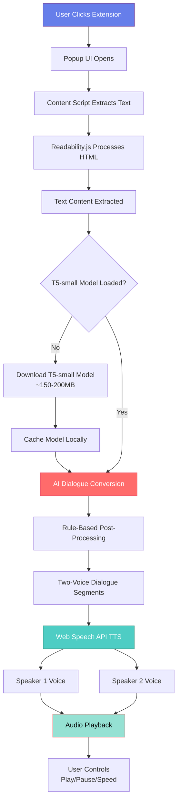
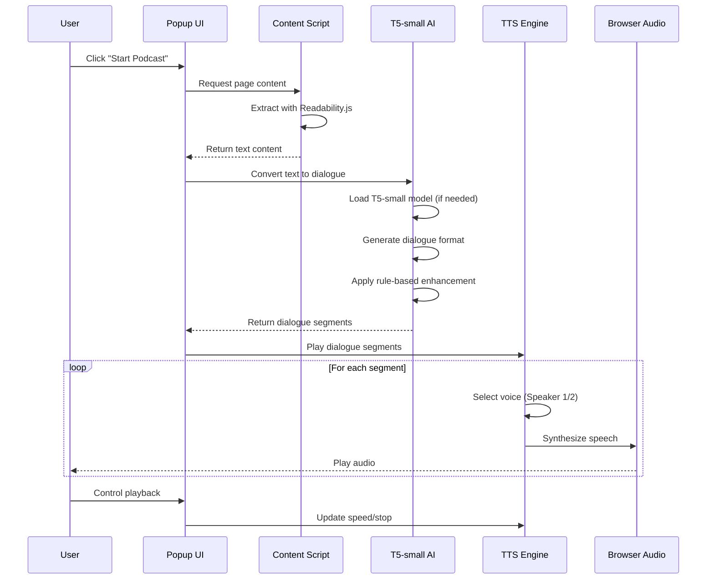

# 🎙️ WebPodify - Chrome Extension

<div align="center">

**Convert any webpage into a 2-person podcast-style conversation using AI**

*100% Client-Side • Free • No Server Required*

[](https://chrome.google.com/webstore)
[](LICENSE)
[](https://reactjs.org/)
[](https://huggingface.co/t5-small)

</div>

---

## ✨ Features

- 🤖 **AI-Powered Dialogue**: Uses T5-small model to convert web content into natural conversations
- 🎙️ **Two-Voice Narration**: Two distinct voices for engaging podcast-style experience
- ⚡ **100% Client-Side**: No server calls, all processing happens in your browser
- 🎚️ **Speed Control**: Adjust playback speed (0.5x - 2.0x)
- 🎭 **Voice Selection**: Choose different accents (one-time setup)
- 💾 **Smart Caching**: Models are cached locally after first download

---

## 🏗️ Architecture & Data Flow



---

## 🔄 Detailed Data Flow



---

## 🛠️ Tech Stack

### Frontend & UI
```
┌─────────────────────────────────────────┐
│         React 18.2                      │
│    ┌─────────────────────────────┐     │
│    │  Popup UI Components         │     │
│    │  Options Page                │     │
│    │  State Management            │     │
│    └─────────────────────────────┘     │
└─────────────────────────────────────────┘
```

### AI & ML
```
┌─────────────────────────────────────────┐
│    Transformers.js                      │
│    ┌─────────────────────────────┐      │
│    │  T5-small Model             │      │
│    │  • Text-to-Text Generation  │      │
│    │  • ~150-200MB (quantized)   │      │
│    │  • Client-side inference    │      │
│    └─────────────────────────────┘      │
└─────────────────────────────────────────┘
```

### Text Processing
```
┌─────────────────────────────────────────┐
│    Readability.js (Mozilla)              │
│    ┌─────────────────────────────┐      │
│    │  Content Extraction        │      │
│    │  • DOM Parsing             │      │
│    │  • Article Detection       │      │
│    │  • Noise Removal           │      │
│    └─────────────────────────────┘      │
└─────────────────────────────────────────┘
```

### Text-to-Speech
```
┌─────────────────────────────────────────┐
│    Web Speech API                       │
│    ┌─────────────────────────────┐      │
│    │  Speech Synthesis           │      │
│    │  • Multi-voice support      │      │
│    │  • Speed control            │      │
│    │  • Accent selection         │      │
│    └─────────────────────────────┘      │
└─────────────────────────────────────────┘
```

### Build Tools
```
┌─────────────────────────────────────────┐
│    Vite 5.1                             │
│    ┌─────────────────────────────┐      │
│    │  • Fast HMR                 │      │
│    │  • Optimized Bundling       │      │
│    │  • Chrome Extension Build   │      │
│    └─────────────────────────────┘      │
└─────────────────────────────────────────┘
```

---

## 🤖 AI Tools & Models

| Tool | Purpose | Size | Type |
|------|---------|------|------|
| **T5-small** | Dialogue generation | ~150-200MB | Text-to-Text Transformer |
| **Transformers.js** | Model runtime | ~2MB | JavaScript ML Library |
| **Readability.js** | Content extraction | ~50KB | DOM Parser |

### AI Model Details

```
T5-small (Text-to-Text Transfer Transformer)
├── Architecture: Encoder-Decoder
├── Parameters: 60M
├── Quantization: 8-bit (for size reduction)
├── Task: Text-to-Text Generation
└── Use Case: Convert web content → Dialogue format
```

---

## 📦 Project Structure

```
webpodcast/
├── 📁 src/
│   ├── 📁 popup/              # React popup UI
│   │   ├── App.jsx            # Main popup component
│   │   ├── App.css            # Popup styles
│   │   └── index.html         # Popup HTML
│   ├── 📁 content/             # Content script
│   │   └── contentScript.js   # Text extraction
│   ├── 📁 background/         # Service worker
│   │   └── serviceWorker.js   # Background tasks
│   ├── 📁 ai/                 # AI integration
│   │   └── dialogueConverter.js # T5-small dialogue conversion
│   ├── 📁 tts/                # Text-to-speech
│   │   └── ttsEngine.js       # TTS engine
│   ├── 📁 utils/              # Utilities
│   │   └── storage.js         # Chrome storage
│   └── 📁 options/             # Settings page
│       ├── Options.jsx
│       ├── Options.css
│       └── index.html
├── 📁 public/                 # Static assets
│   └── 📁 icons/              # Extension icons
├── 📁 dist/                   # Built extension
├── manifest.json              # Extension config
├── package.json               # Dependencies
└── vite.config.js             # Build config
```

---

## 🚀 Installation

### Prerequisites
- Node.js 18+ 
- npm or yarn
- Google Chrome browser

### Steps

1. **Clone the repository**
   ```bash
   git clone https://github.com/swati2904/webpodcast.git
   cd webpodcast
   ```

2. **Install dependencies**
   ```bash
   npm install
   ```

3. **Build the extension**
   ```bash
   npm run build
   ```

4. **Load in Chrome**
   - Open `chrome://extensions/`
   - Enable "Developer mode" (top-right toggle)
   - Click "Load unpacked"
   - Select the `dist` folder

5. **First Use**
   - Click extension icon on any webpage
   - Click "Start Podcast"
   - Wait for AI model download (~150-200MB, one-time)
   - Enjoy your podcast!

---

## 💻 Development

```bash
# Development mode
npm run dev

# Build for production
npm run build

# Preview build
npm run preview
```

---

## 🌐 Website Deployment

The landing page is deployed on Vercel. To deploy updates:

### Prerequisites
- Vercel CLI installed: `npm install -g vercel`
- Logged in to Vercel: `vercel login` (first time only)

### Deploy Website

```bash
# Deploy to production
npm run website:deploy
```

This will:
1. Navigate to the `website` folder
2. Deploy all files to Vercel production
3. Provide you with the live URL

### Local Website Development

```bash
# Run local server for website
npm run website:dev
```

Opens at `http://localhost:3000`

### Website Files
- Landing page: `website/index.html`
- Privacy policy: `website/privacy-policy.html`
- Styles: `website/styles.css`
- Config: `website/vercel.json`

---

## 🎯 How It Works

### Step-by-Step Process

1. **📄 Text Extraction**
   - Content script extracts main content from webpage
   - Uses Readability.js to filter out ads/navigation
   - Returns clean, readable content

2. **🤖 AI Dialogue Conversion**
   - T5-small model converts text to dialogue format
   - Creates natural conversation between two speakers
   - Rule-based post-processing adds transitions

3. **🎙️ Voice Synthesis**
   - Web Speech API synthesizes speech
   - Two distinct voices alternate
   - Natural pauses between speakers

4. **🎵 Playback**
   - User controls speed, pause, stop
   - Progress tracking
   - Settings persistence

---

## 📊 Model Sizes

```
Extension Size Breakdown:
├── Core Extension:     ~5-10MB
├── T5-small Model:     ~150-200MB (cached after first download)
├── TTS Voices:         ~50MB (when Piper integrated)
└── Total (after setup): ~200-260MB (cached locally)
```

---

## 🎨 UI Features

- ✨ **Modern Design**: Gradient backgrounds, smooth animations
- 🎯 **Intuitive Controls**: Easy-to-use interface
- 📊 **Progress Tracking**: Real-time progress indicators
- ⚙️ **Settings Page**: One-time voice configuration
- 🎚️ **Speed Control**: Adjustable playback speed

---

## 🔧 Configuration

### Voice Settings
- Select accents for Speaker 1 (Host/Interviewer)
- Select accents for Speaker 2 (Expert/Guest)
- Set default playback speed
- Settings saved automatically

### Supported Accents
- 🇺🇸 American English
- 🇬🇧 British English
- 🇮🇳 Indian English
- 🇦🇺 Australian English
- 🇨🇦 Canadian English

---

## 🐛 Troubleshooting

| Issue | Solution |
|-------|----------|
| Model not loading | Check internet connection, reload extension |
| No audio | Check browser volume, try different accents |
| Content not extracted | Try different website, check browser console |
| Extension crashes | Reload extension, check console for errors |

---

## 📝 License

MIT License - see [LICENSE](LICENSE) file for details

---

## 🙏 Acknowledgments

- **Transformers.js** - Client-side ML runtime
- **T5-small** - Hugging Face model
- **Readability.js** - Mozilla content extraction
- **React** - UI framework

---

## 📈 Future Enhancements

- [ ] Piper TTS integration for better voice quality
- [ ] More dialogue formats (interview, discussion, debate)
- [ ] Multiple language support
- [ ] Audio export (MP3 download)
- [ ] Bookmark/save position
- [ ] Text highlighting during playback

---

<div align="center">

**Made with ❤️ using AI**

[⭐ Star this repo](https://github.com/swati2904/webpodcast) • [🐛 Report Bug](https://github.com/swati2904/webpodcast/issues) • [💡 Request Feature](https://github.com/swati2904/webpodcast/issues)

</div>
